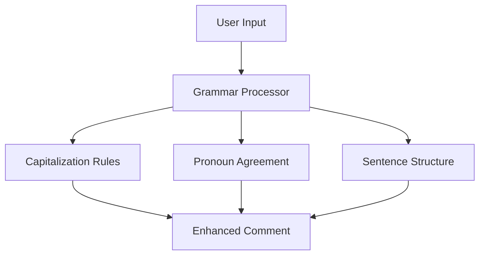
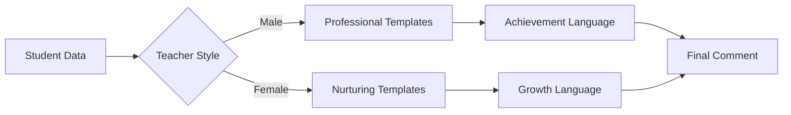
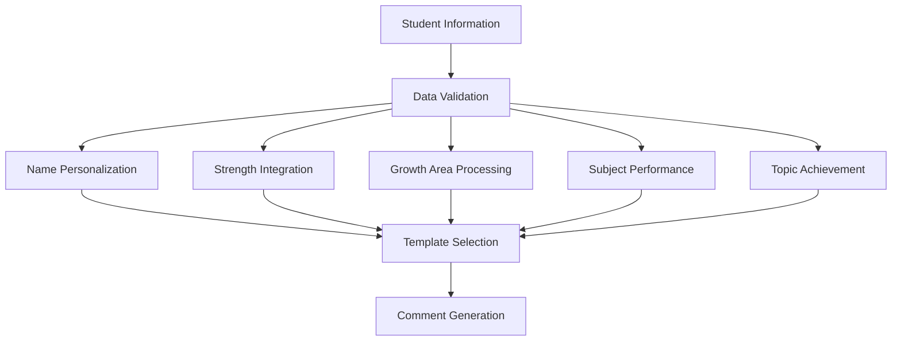

# Comment Personality Enhancement Design

## Overview

This design document outlines enhancements to the Teacher's Pet comment generation system to improve grammar quality, create distinct personality differences between male and female teacher styles, ensure comprehensive utilization of all user-provided information, and eliminate generic references in favor of personalized student names.

## Current System Analysis

### Existing Architecture
The current comment generation system uses a class-based architecture (`OptimizedCommentGenerator`) with:
- **Performance mapping** (1-10 scale with descriptive language)
- **Grammar rules** (pronoun systems and subject capitalization)
- **Sentence templates** (separate male/female teacher styles)
- **Template selection** (random selection with variety tracking)
- **Placeholder replacement** (dynamic content insertion)

### Identified Issues
1. **Limited personality differentiation**: Male and female styles share similar language patterns
2. **Grammar inconsistencies**: Capitalization errors after sentence endings
3. **Generic student references**: Occasional use of "The student" instead of names
4. **Incomplete data utilization**: Not all user inputs are consistently incorporated

## Enhanced Grammar System

### Grammar Rule Enhancements

### Grammar Optimization Features
- **Advanced capitalization handling**: Post-sentence punctuation capitalization
- **Enhanced pronoun system**: Expanded pronoun variants with proper capitalization
- **Sentence flow optimization**: Improved transitions between sentence elements
- **Punctuation standardization**: Consistent ending punctuation enforcement

### Implementation Strategy
- Extend `improveGrammar()` function with comprehensive grammar rules
- Add pre-processing validation for common grammar patterns
- Implement contextual capitalization based on sentence position
- Create grammar validation pipeline for generated comments

## Personality Differentiation System

### Male Teacher Style Characteristics
- **Language tone**: Professional, structured, achievement-focused
- **Assessment approach**: Performance-based with objective measurements
- **Vocabulary emphasis**: "demonstrated", "achieved", "maintained", "standards"
- **Progress description**: Goal-oriented with measurable outcomes
- **Encouragement style**: Future-focused with concrete expectations

### Female Teacher Style Characteristics
- **Language tone**: Nurturing, celebration-focused, growth-oriented
- **Assessment approach**: Holistic development with emotional intelligence
- **Vocabulary emphasis**: "flourished", "blossomed", "wonderful", "joy", "beautiful"
- **Progress description**: Journey-focused with emotional connections
- **Encouragement style**: Present-moment celebration with gentle guidance

### Enhanced Template Structure

### Personality Enhancement Features
- **Expanded vocabulary sets**: Style-specific word choices and phrases
- **Distinctive sentence structures**: Different approaches to information presentation
- **Unique opening patterns**: Style-specific comment introductions
- **Varied conclusion styles**: Different approaches to future encouragement

## Comprehensive Data Integration

### User Information Mapping
| Data Element | Current Usage | Enhanced Usage |
|--------------|---------------|----------------|
| Student Name | Inconsistent referencing | Primary subject in all sentences |
| Gender | Pronoun selection only | Style-specific language adaptation |
| Overall Rating | Performance descriptor | Comprehensive language tone |
| Strengths | Optional inclusion | Mandatory feature highlighting |
| Weaknesses | Limited mention | Constructive growth opportunities |
| Selected Subjects | General references | Specific performance integration |
| Selected Topics | Activity mentions | Detailed achievement descriptions |

### Data Utilization Flow

### Implementation Requirements
- **Mandatory data inclusion**: All provided information must appear in comments
- **Intelligent prioritization**: Higher-rated subjects/topics receive prominence
- **Balanced representation**: Equal attention to strengths and growth areas
- **Context-appropriate integration**: Natural incorporation without forced inclusion

## Student Name Personalization

### Name Reference Strategy
- **Primary subject usage**: Student name as main sentence subject (70% of sentences)
- **Pronoun variation**: Strategic pronoun use for sentence flow (30% of sentences)
- **Context-appropriate selection**: Name vs. pronoun based on sentence structure
- **Elimination of generic terms**: Complete removal of "The student" references

### Name Integration Patterns
1. **Opening statements**: Always begin with student name
2. **Achievement descriptions**: Name-focused accomplishment statements
3. **Growth opportunities**: Personalized improvement discussions
4. **Concluding remarks**: Name-based future encouragement

## Enhanced Template System

### Template Categories by Section
1. **Opening Statements** (3 variations per style)
2. **Strength Highlights** (4 variations per style)
3. **Subject Performance** (4 variations per style)
4. **Topic Achievements** (5 variations per style)
5. **Growth Opportunities** (4 variations per style)
6. **Social/Behavioral** (3 variations per style)
7. **Future Encouragement** (4 variations per style)

### Template Selection Algorithm
- **Variety tracking**: Prevent template repetition within single comment
- **Style consistency**: Maintain personality throughout comment sections
- **Content relevance**: Match templates to available data elements
- **Flow optimization**: Select templates that create natural transitions

## Testing Strategy

### Grammar Validation Tests
- **Capitalization accuracy**: Sentence beginnings and proper nouns
- **Pronoun agreement**: Gender-appropriate pronoun consistency
- **Punctuation standardization**: Proper sentence endings
- **Flow assessment**: Natural reading experience

### Personality Differentiation Tests
- **Vocabulary analysis**: Style-specific word usage verification
- **Tone consistency**: Personality maintenance across comment sections
- **Language pattern validation**: Distinctive style characteristics
- **User perception testing**: Clear style differentiation recognition

### Data Integration Tests
- **Completeness verification**: All user inputs represented
- **Name usage analysis**: Student name frequency and appropriateness
- **Information balance**: Proportional representation of all data elements
- **Natural incorporation**: Seamless data integration assessment

## Technical Implementation

### Core Enhancement Areas
1. **Grammar Engine**: Enhanced `improveGrammar()` with comprehensive rules
2. **Personality Templates**: Expanded male/female template collections
3. **Data Processor**: Improved `processTextArray()` with mandatory inclusion
4. **Name Manager**: New `ensureNameUsage()` function for personalization
5. **Validation System**: Pre and post-generation quality assurance

### Integration Approach
- **Backward compatibility**: Maintain existing function signatures
- **Progressive enhancement**: Layer new features over existing system
- **Performance optimization**: Efficient template selection and processing
- **Error handling**: Robust fallback mechanisms for missing data

### Quality Assurance Pipeline
- **Pre-generation validation**: Input data completeness verification
- **Template application**: Style-appropriate template selection
- **Grammar processing**: Comprehensive grammar rule application
- **Post-generation review**: Final quality and completeness checkThe current comment generation system uses a class-based architecture (`OptimizedCommentGenerator`) with:
- **Performance mapping** (1-10 scale with descriptive language)
- **Grammar rules** (pronoun systems and subject capitalization)
- **Sentence templates** (separate male/female teacher styles)
- **Template selection** (random selection with variety tracking)
- **Placeholder replacement** (dynamic content insertion)

### Identified Issues
1. **Limited personality differentiation**: Male and female styles share similar language patterns
2. **Grammar inconsistencies**: Capitalization errors after sentence endings
3. **Generic student references**: Occasional use of "The student" instead of names
4. **Incomplete data utilization**: Not all user inputs are consistently incorporated

## Enhanced Grammar System

### Grammar Rule Enhancements

### Grammar Optimization Features
- **Advanced capitalization handling**: Post-sentence punctuation capitalization
- **Enhanced pronoun system**: Expanded pronoun variants with proper capitalization
- **Sentence flow optimization**: Improved transitions between sentence elements
- **Punctuation standardization**: Consistent ending punctuation enforcement

### Implementation Strategy
- Extend `improveGrammar()` function with comprehensive grammar rules
- Add pre-processing validation for common grammar patterns
- Implement contextual capitalization based on sentence position
- Create grammar validation pipeline for generated comments

## Personality Differentiation System

### Male Teacher Style Characteristics
- **Language tone**: Professional, structured, achievement-focused
- **Assessment approach**: Performance-based with objective measurements
- **Vocabulary emphasis**: "demonstrated", "achieved", "maintained", "standards"
- **Progress description**: Goal-oriented with measurable outcomes
- **Encouragement style**: Future-focused with concrete expectations

### Female Teacher Style Characteristics
- **Language tone**: Nurturing, celebration-focused, growth-oriented
- **Assessment approach**: Holistic development with emotional intelligence
- **Vocabulary emphasis**: "flourished", "blossomed", "wonderful", "joy", "beautiful"
- **Progress description**: Journey-focused with emotional connections
- **Encouragement style**: Present-moment celebration with gentle guidance

### Enhanced Template Structure

### Personality Enhancement Features
- **Expanded vocabulary sets**: Style-specific word choices and phrases
- **Distinctive sentence structures**: Different approaches to information presentation
- **Unique opening patterns**: Style-specific comment introductions
- **Varied conclusion styles**: Different approaches to future encouragement

## Comprehensive Data Integration

### User Information Mapping
| Data Element | Current Usage | Enhanced Usage |
|--------------|---------------|----------------|
| Student Name | Inconsistent referencing | Primary subject in all sentences |
| Gender | Pronoun selection only | Style-specific language adaptation |
| Overall Rating | Performance descriptor | Comprehensive language tone |
| Strengths | Optional inclusion | Mandatory feature highlighting |
| Weaknesses | Limited mention | Constructive growth opportunities |
| Selected Subjects | General references | Specific performance integration |
| Selected Topics | Activity mentions | Detailed achievement descriptions |

### Data Utilization Flow

### Implementation Requirements
- **Mandatory data inclusion**: All provided information must appear in comments
- **Intelligent prioritization**: Higher-rated subjects/topics receive prominence
- **Balanced representation**: Equal attention to strengths and growth areas
- **Context-appropriate integration**: Natural incorporation without forced inclusion

## Student Name Personalization

### Name Reference Strategy
- **Primary subject usage**: Student name as main sentence subject (70% of sentences)
- **Pronoun variation**: Strategic pronoun use for sentence flow (30% of sentences)
- **Context-appropriate selection**: Name vs. pronoun based on sentence structure
- **Elimination of generic terms**: Complete removal of "The student" references

### Name Integration Patterns
1. **Opening statements**: Always begin with student name
2. **Achievement descriptions**: Name-focused accomplishment statements
3. **Growth opportunities**: Personalized improvement discussions
4. **Concluding remarks**: Name-based future encouragement

## Enhanced Template System

### Template Categories by Section
1. **Opening Statements** (3 variations per style)
2. **Strength Highlights** (4 variations per style)
3. **Subject Performance** (4 variations per style)
4. **Topic Achievements** (5 variations per style)
5. **Growth Opportunities** (4 variations per style)
6. **Social/Behavioral** (3 variations per style)
7. **Future Encouragement** (4 variations per style)

### Template Selection Algorithm
- **Variety tracking**: Prevent template repetition within single comment
- **Style consistency**: Maintain personality throughout comment sections
- **Content relevance**: Match templates to available data elements
- **Flow optimization**: Select templates that create natural transitions

## Testing Strategy

### Grammar Validation Tests
- **Capitalization accuracy**: Sentence beginnings and proper nouns
- **Pronoun agreement**: Gender-appropriate pronoun consistency
- **Punctuation standardization**: Proper sentence endings
- **Flow assessment**: Natural reading experience

### Personality Differentiation Tests
- **Vocabulary analysis**: Style-specific word usage verification
- **Tone consistency**: Personality maintenance across comment sections
- **Language pattern validation**: Distinctive style characteristics
- **User perception testing**: Clear style differentiation recognition

### Data Integration Tests
- **Completeness verification**: All user inputs represented
- **Name usage analysis**: Student name frequency and appropriateness
- **Information balance**: Proportional representation of all data elements
- **Natural incorporation**: Seamless data integration assessment

## Technical Implementation

### Core Enhancement Areas
1. **Grammar Engine**: Enhanced `improveGrammar()` with comprehensive rules
2. **Personality Templates**: Expanded male/female template collections
3. **Data Processor**: Improved `processTextArray()` with mandatory inclusion
4. **Name Manager**: New `ensureNameUsage()` function for personalization
5. **Validation System**: Pre and post-generation quality assurance

### Integration Approach
- **Backward compatibility**: Maintain existing function signatures
- **Progressive enhancement**: Layer new features over existing system
- **Performance optimization**: Efficient template selection and processing
- **Error handling**: Robust fallback mechanisms for missing data

### Quality Assurance Pipeline
- **Pre-generation validation**: Input data completeness verification
- **Template application**: Style-appropriate template selection
- **Grammar processing**: Comprehensive grammar rule application
- **Post-generation review**: Final quality and completeness check

